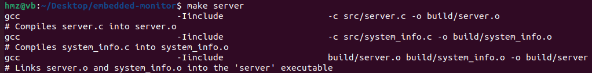
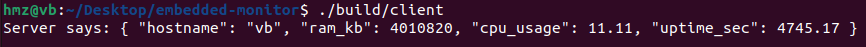

## Embedded System Monitor (Client-Server in C)

A simple educational project written in **C** that demonstrates:
- Socket programming (client/server communication over TCP).
- Reading Linux `/proc` files for system information (RAM, CPU, uptime, hostname).
- Using a Makefile for compilation.

Note : This is a **learning project** — not meant for production use, that i did in my free time to learn more about C and networking.

## Build & Run
**Open two terminals**

## Terminal 1 
 Type Those commands in order : 
 1)make server (it will link the system_info.c  and the server.c source files and turn them into just server that we will be executing later )
 
 2)./build/server
 

## Terminal 2
 Same commands just change server with client lol : 
 1)make client
 
 2)./build/client 
 
 
##### **make clean** ;)

## Resources

- [Beej's Guide to Network Programming
Using Internet Sockets](https://beej.us/guide/bgnet/).
- man
- [makefiletutorial.com](https://makefiletutorial.com/)

